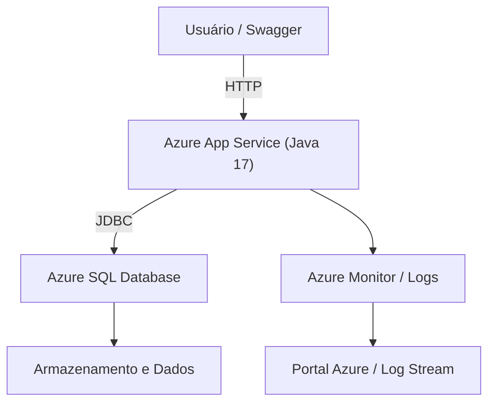

# ☁️ FIAP - DevOps & Cloud Computing | Infra Challenge 2025

Este repositório contém toda a **infraestrutura e automação de deploy em nuvem (Azure)** da aplicação backend [`challenge-java-api`](https://github.com/thiag0renatino/challenge-java-api).

---

## 📘 Sobre o Projeto

O objetivo deste repositório é **automatizar a criação, configuração e deploy** da aplicação **Java Spring Boot** no **Microsoft Azure App Service**, incluindo:

- Criação do **Resource Group** e **SQL Server Database** (Azure SQL)
- Configuração automática de **firewall, logs e variáveis de ambiente**
- Deploy do **backend Java** hospedado no Azure
- Scripts para **configuração, deploy e limpeza de recursos**

---

## 🧩 Estrutura do Projeto

```
infra-challenge-java-api/
├── challenge-api/                 # Aplicação Java (submódulo local)
├── database/
│   ├── script_bd.sql              # Script DDL de criação de tabelas
│   ├── seed_data.sql              # Inserts modelo
│
├── scripts/
│   ├── azure-create-resources.sh  # Criação completa da infra (Resource Group, SQL, App Service)
│   ├── azure-configure-db.sh      # Configuração inicial do banco e credenciais
│   ├── azure-deploy-app.sh        # Deploy da aplicação Java no App Service
│   ├── azure-cleanup.sh           # Remoção de todos os recursos criados
│   └── README.md                  # Documentação dos scripts
│
├── HELP.md                        # Guia auxiliar de comandos
└── README.md                      # Este arquivo
```

---

## ☁️ Arquitetura da Solução



- **Backend Java Spring Boot (App Service)**  
  Hospeda a API `challenge-java-api` integrada via JDBC ao banco em nuvem.

- **Azure SQL Database**  
  Banco relacional SQL Server criado e configurado automaticamente.

- **Shell Scripts (Azure CLI)**  
  Responsáveis por criar, configurar e destruir toda a infraestrutura.

---

## 🚀 Passo a Passo de Execução

### 1️⃣ Pré-requisitos

- Conta ativa no [Microsoft Azure](https://portal.azure.com/)
- **Azure CLI** instalada → [Guia de instalação](https://learn.microsoft.com/cli/azure/install-azure-cli)
- Acesso ao **Bash** (Windows Git Bash, WSL ou Linux terminal)
- Estar autenticado na Azure:
  ```bash
  az login
  ```

---

### 2️⃣ Criar Recursos na Nuvem

Cria o grupo de recursos, servidor SQL, banco e App Service:

```bash
./scripts/azure-create-resources.sh
```

Este script executa automaticamente:

- Criação do Resource Group `rg-challenge-mottu`
- Criação do SQL Server `sql-mottu-rm556934`
- Criação do Database `mottu_db`
- Configuração de firewall, logs e variáveis de ambiente
- Geração do arquivo `credentials.txt` com credenciais e URLs úteis

---

### 3️⃣ Configurar o Banco

```bash
./scripts/azure-configure-db.sh
```

Responsável por executar os scripts SQL (Migrations) diretamente no Azure SQL.

---

### 4️⃣ Realizar o Deploy da API

```bash
./scripts/azure-deploy-app.sh
```

Publica a aplicação Java no **App Service** e aplica as configurações do `application-azure.properties`.

---

### 5️⃣ Limpar Recursos (opcional)

Para evitar custos após os testes:

```bash
./scripts/azure-cleanup.sh
```

Remove o grupo de recursos e todos os componentes criados.

---

## 🧱 Tecnologias Utilizadas

| Categoria | Ferramenta |
|------------|-------------|
| ☁️ Nuvem | Microsoft Azure |
| 🧰 Infraestrutura | Azure CLI, Bash Scripts |
| 🧩 Backend | Java 17, Spring Boot 3 |
| 🗄️ Banco | Azure SQL Database (SQL Server) |
| 🐋 Container | Docker, Dockerfile |
| 🧾 Logs | Azure App Service Log Stream |

---


## 👨‍💻 Alunos

| Nome | RM |
|------|----|
| **Thiago Renatino Paulino** | **RM556934** |
| **Cauan Matos Moura** | **RM558821** |
| **Gustavo Roberto** | **RM558033** |

🎓 FIAP – Análise e Desenvolvimento de Sistemas  

---

## 📄 Licença

Este projeto é de uso **acadêmico** e faz parte do **Global Solution FIAP 2025**.  
